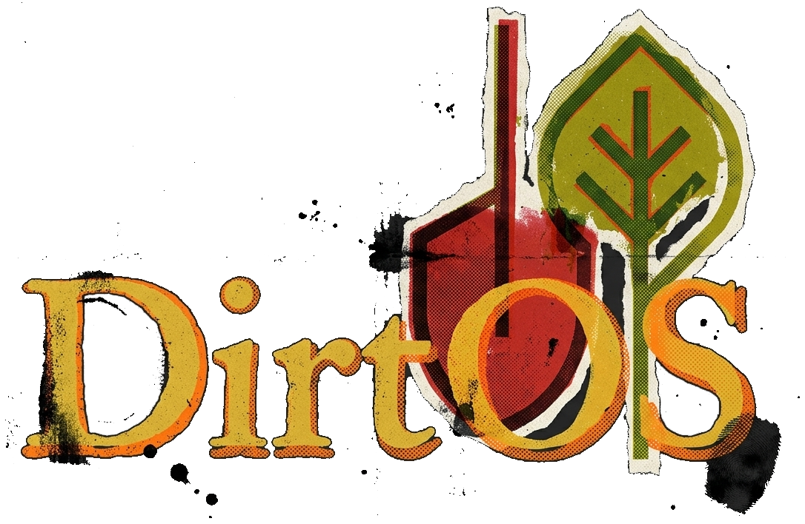

# DirtOS

> DirtOS is a unified application for home gardening that facilitates planning, lifecycles, monitoring, and management of gardens of all shapes/sizes.

## Features

### Drawing and Design Tools

- Outline gardens of any shape/size with configurable grids that optimize for space and plants' needs.
- Graphical tools to easily layout vegetable and herb gardens, as well as flowers, raised beds, and potted plants.
- Use graphical tools to quickly create tilled areas, paths, fences, stakes, raised beds, irrigation, shaders, potted plants, trees, lights, indoor grow tents, ventilation systems, sheds, and custom objects.
- 2D planning with 3D previews and simulations for sunlight and weather.
- 3D animation of seasonally accurate solar motion and position above the garden plots.
- Support for importing models from SketchUp, FreeCAD, Blender, etc..

### Integrated Plant Database & Encyclopedia

- Integrated with the [iNaturalist API](https://api.inaturalist.org/v1/docs/) to incorporate real plant data and images
- Integrated with [Wikipedia](https://en.wikipedia.org/api/rest_v1/?spec) to pull in more details and important attributes for each plant species
- Built-in database with all common plants included, with extensive attributes and fields for making information readily available and accessible.
- Built-in database includes a wide variety of default/generic soil types, fertilizers, and water/soil additives to help determine the garden's ideal conditions, and track health/quality.
- Users can add their own custom fields, attributes, and/or photos.
- Each individual plant added to the garden is included as its own entry in the database that's linked to its respective species, and given customizable attributes and fields specific to that individual for things like notes, dates, photos, attachments, and geneological information (if the plant was grown from a seed harvested from another plant in the garden), and purchase information (if it was bought).

### Suite of Gardening Tools & Utilities

- Planting and harvest calendars
- Integrated weather and forecasts from [OpenWeather](https://openweathermap.org)
- Customizable groups defined by plants' types, seasonal requirements, sun/shade tolerance, ideal climate, size/shape, etc.
- Automatic and intelligent optimization of garden layout, shape, position, and planting attributes based on defined parameters for things like plants' types, seasonal requirements, sun/shade tolerance, ideal climate, size/shape, etc.
- Seedling planners with customizable seedling trays for starting plants indoors with their own distinct schedules and attributes. Seedlings primary characteristics are germination time, height, stem thickness, number of leaf nodes, spacing of leaf nodes, and age. Seedlings can then be transplanted into open positions within the garden plots when they are determined ready via their recorded characteristics and common conventions pulled from their entries on iNaturalist and/or Wikipedia.
- Indoor gardens with/without hydroponics can be fit with lighting and ventilation rigs, and given distinct metrics relevant to indoor gardening.

### Advanced Management & Monitoring

- Locations such as garden plots, individual plant spaces, indoor grow tents, and seedling trays are assigned ID numbers, and customizable labels, to track the locations of all plants along their journey from seed to harvest.
- Garden issue tracker with ticketing, progress tracking (New/Open/In Progress/Closed), and notes. Labels for common issues such as insect damage, fungal infections, health issues, and out-of-limits feeding/watering can be assigned and used to organize/filter tickets. Tasks can be set to recur on defined schedules for things like feeding/watering/maintenance/treatment, which will then create new tickets to alert the user.
- Garden journal that allows for quickly and easily recording notes, conditions, environment, and photos that are tagged with the individual plant's ID and date/time, and attached to its respective plant's records. Any issue tickets opened for a given plant will also be linked inside its respective journal.
- Soil testing and records to track the quality and health of the garden's soil. Basic soil composition can be estimated based on location, and further defined using soil testing kits to record pH, nitrogen levels, moisture capacity, etc.. Soil problems and/or routine maintenance tasks can be tracked using the garden issue tracker.
- Feeding, watering, and maintenance schedules defined by defaults found in iNaturalist and Wikipedia data, and customized by the user. Schedules create recurring garden issue tickets to alert the user when garden maintenance is required.
- Sensors for light, soil moisture, soil composition, weather, air quality, and more can be integrated and assigned to garden plots and/or specific individual plant spaces for advanced realtime monitoring. Sensor values and limits can be defined, and incidents where the sensor readings are under/over the limits trigger a new issue in the garden issue tracker.
- Alerts for upcoming scheduled events, as well as severe weather warnings, and detected variance from recommended conditions will generate new garden issue tickets to alert the user of potential problems.

## Documentation

- [Phase 10a: Integrations & Extensions](docs/phase-10a-integrations.md)
- [User Guide](docs/USER_GUIDE.md)
- [Architecture](docs/ARCHITECTURE.md)
- [Developer Guide](DEVELOPER.md)
- [Contributing](CONTRIBUTING.md)
