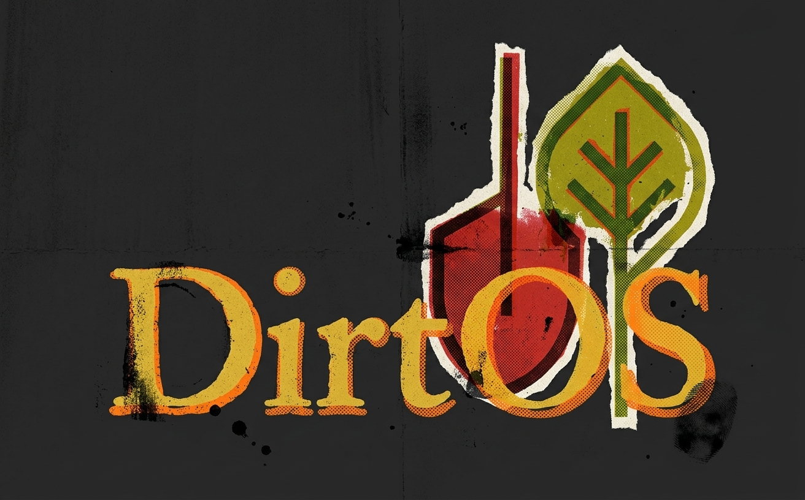

DirtOS is a local-first desktop platform for planning, tracking, and
operating home gardens.

This documentation is organized so you can:

1. Get up and running quickly.
2. Learn common workflows.
3. Look up feature details and field-level references.

The documentation release track is versioned independently from DirtOS itself.
Use the version switcher in the sidebar to move between the current docs and
any archived snapshots.

> [SCREENSHOT:docs-home-overview]
> Capture the docs home page after final formatting and theme polish.

## Docs Versioning

- Current docs release metadata lives in `docs.versions.json`.
- Build the current docs release with `pnpm docsmd`.
- Archive the current docs and advance the active docs release with
  `pnpm docsmd:snapshot -- <new-id> "<label>"`.

## Start Here

- [Installation](getting-started/installation.md)
- [First Run](getting-started/first-run.md)
- [Example Garden](getting-started/example-garden.md)

## Common Guides

- [Core Workflow](guides/core-workflow.md)
- [Common Tasks](guides/common-tasks.md)
- [Import, Export, Backup](guides/import-export-backup.md)
- [Integrations](guides/integrations.md)

## Feature Reference

- [Feature Matrix](reference/feature-matrix.md)
- [Environments and Locations](reference/environments-locations.md)
- [Plants and Species](reference/plants-species.md)
- [Seedlings and Trays](reference/seedlings-trays.md)
- [Indoor Environments](reference/indoor-environments.md)
- [Schedules](reference/schedules.md)
- [Sensors](reference/sensors.md)
- [Issues](reference/issues.md)
- [Journal](reference/journal.md)
- [Weather](reference/weather.md)
- [Reports](reference/reports.md)
- [Integrations and API Keys](reference/integrations-and-keys.md)
- [Architecture](reference/architecture.md)
- [Glossary](reference/glossary.md)

## Keywords

Use these linked keywords to jump directly to topic references:

- [Asset Tag](reference/glossary.md#asset-tag)
- [Environment](reference/glossary.md#environment)
- [Location](reference/glossary.md#location)
- [Plant Status](reference/glossary.md#plant-status)
- [Issue Priority](reference/glossary.md#issue-priority)
- [Schedule Run](reference/glossary.md#schedule-run)
- [Sensor Limit](reference/glossary.md#sensor-limit)
- [Backup Export](reference/glossary.md#backup-export)
